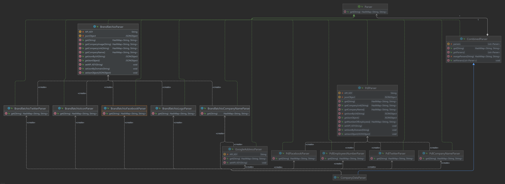
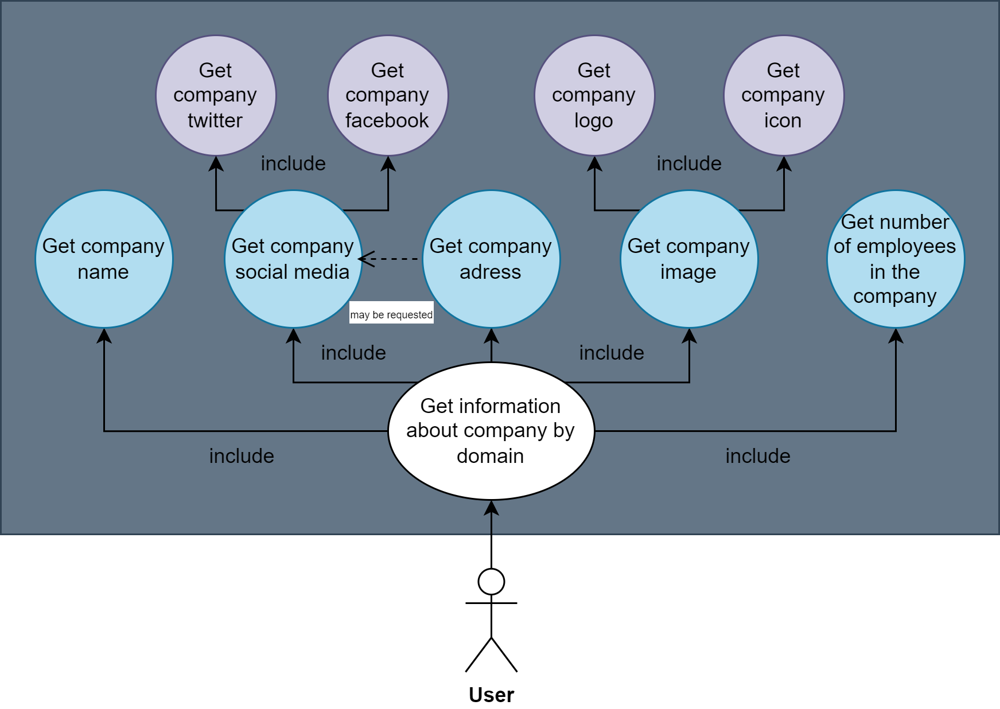

# Parser of information about company.

#### Authors: Mykyta Ishchenko (_the rest of the team did not make contact_).
#### Team number: 22.

## About project
It's the solution that will allow you to extract information about a company from its domain. This application
should support the following information:

- Company name
- Twitter URL
- Facebook URL
- Company logo
- Company icon
- Number of employees
- Company address

Use [**Example.java**](company-data-parser/src/main/java/org/ucu/comparser/example/Example.java) to see example of using [**CompanyDataParser.java**](company-data-parser/src/main/java/org/ucu/comparser/parsers/CompanyDataParser.java) and some other results.
> Before run it, don't forget to paste your api keys in [Config.java](company-data-parser/src/main/java/org/ucu/comparser/config/Config.java).

## About Patterns:
When writing classes, I tried to comprehensively use the **SOLID** pattern, especially: 
Single Responsibility Principle, Open/Closed Principle, Interface Segregation Principle.
Methods are open to modifications and separated so that one class does not perform more than one function, interfaces are used wisely (for example, the use of an interface for parsers then made it possible to combine them for more complex purposes) etc.

As a result, this gave us the opportunity to easily supplement the functionality of parsers, replace the "basic parsers" (like PdlParser), and use several at the same time in many flexible variations.

And of course I always try to remember the fun pattern **D**on't **R**epeat **Y**ourself. :) 

## Classes diagram
> Diagrams in higher resolution you can find in the repository [diagrams](diagrams).
> 

## Use case diagram

